<div align="center">


<br/><br/>

# 🔀 Switch Swap

### *Your hardware keys, reprogrammed.*

**Switch Swap** is a Dual-Engine Android hardware interception system that turns your phone's physical buttons into a fully programmable macro controller — recording key sequences, mapping them to powerful system actions, and executing them **even when the app UI is completely closed**.

> ⚙️ Architecture: **Flutter UI + Headless Dart Isolate + Kotlin AccessibilityService**

<br/>

[🚀 Getting Started](#-getting-started) • [✨ Features](#-features) • [📸 Screenshots](#-screenshots) • [🏗️ Architecture](#%EF%B8%8F-the-dual-engine-architecture) • [🛠️ Tech Stack](#%EF%B8%8F-tech-stack) • [🔬 Engineering Deep Dive](#-engineering-deep-dive)

</div>

---

## 💡 What Makes This Different

Most "key mapper" apps die the moment Android kills their background process. Switch Swap doesn't.

It runs as **two completely isolated engines** sharing a single database — a Flutter frontend for recording and configuring macros, and a **headless Dart isolate living inside a native Kotlin AccessibilityService** that intercepts physical keys globally, even with zero UI on screen. If Android assassinates the background engine to save battery, the moment you press a physical button, Switch Swap detects the dead isolate and **cold-boots it instantly** — your macros never silently fail.

---

## ✨ Features

| Feature | Description |
|---|---|
| 🎙️ **Live Sequence Recorder** | Press physical hardware keys (Volume Up/Down, etc.) and watch them captured in real-time with a "Listening" mic UI |
| ⚡ **100+ Action Library** | Launch apps, open URLs, toggle flashlight, control media playback, simulate gestures, expand notification shade, toggle split screen, and more |
| 🔗 **Trigger → Action Mapping** | Map any captured key sequence (single, double, triple press) to one or multiple chained actions |
| 🧩 **Macro Builder** | Chain multiple actions with custom delays (ms) between each step — flashlight → vibrate → gesture tap, all in sequence |
| 🔁 **Execution Loops** | Set a macro to repeat N times automatically (e.g. flash blink ×4) |
| 🚦 **Execution Constraints** | Gate automation behind device state: Screen On/Off, Locked/Unlocked, Wi-Fi Connected/Disconnected, Charging/Unplugged |
| 🎯 **Multi-Input Source Support** | Configure triggers from Keyboard, Phone (hardware buttons), Gamepad, or Headset input |
| 🛡️ **Permission Guardrails** | In-app "Permissions Missing" banner with one-tap **FIX** button linking straight to Accessibility settings |
| 🌙 **Zero-UI Background Execution** | The detection engine survives even with the app fully swiped away from recents |
| 🔄 **Passthrough Safety Valve** | Keys not part of any macro get reinjected back into Android so normal volume/media buttons keep working normally |

---

## 📸 Screenshots

<div align="center">

### 🎙️ Trigger Recording

<table>
  <tr>
    <td align="center"><b>Listening for Hardware Keys</b></td>
    <td align="center"><b>Configure Trigger Profile</b></td>
  </tr>
  <tr>
    <td>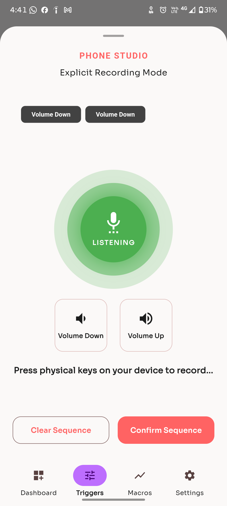</td>
    <td>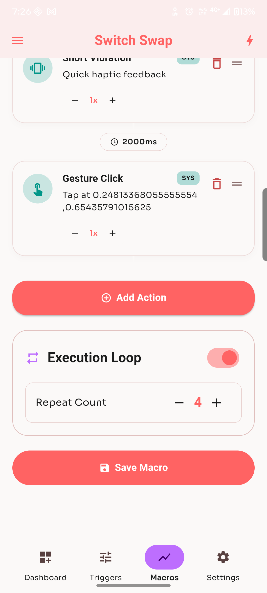</td>
  </tr>
</table>

---

### ⚡ Action Selection & Macro Building

<table>
  <tr>
    <td align="center"><b>Select Action (100+ Commands)</b></td>
    <td align="center"><b>Macro Builder — Add Actions</b></td>
    <td align="center"><b>Macro Builder — Execution Loop</b></td>
  </tr>
  <tr>
    <td>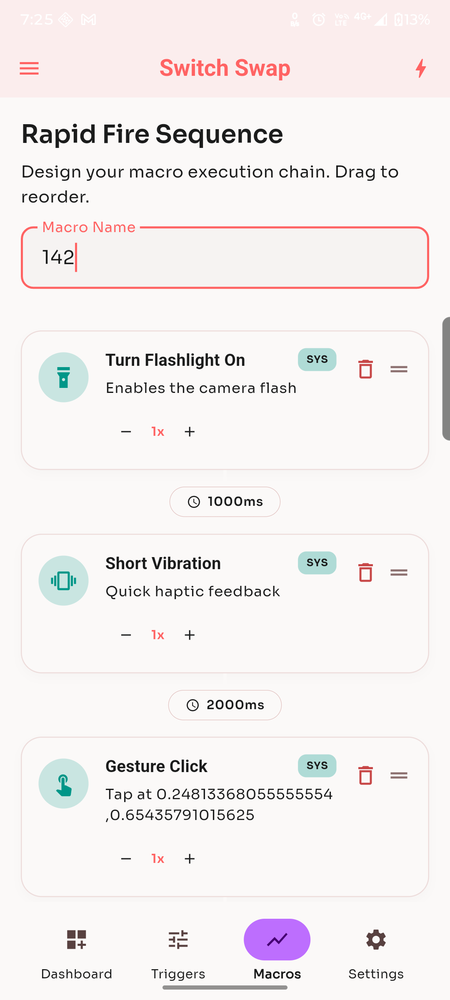</td>
    <td>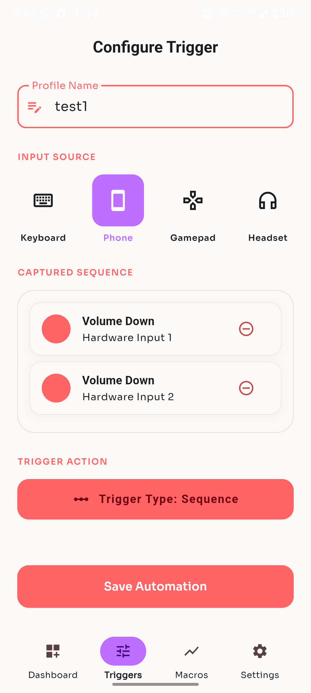</td>
    <td>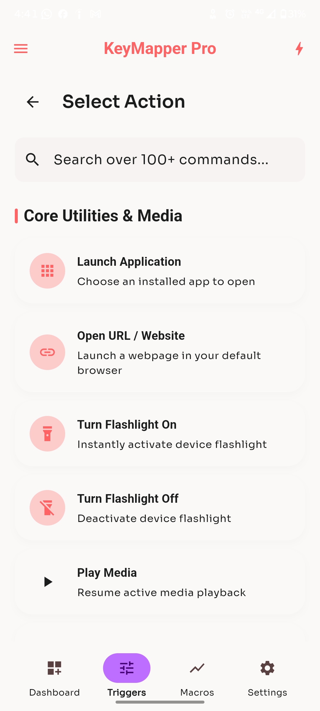</td>
  </tr>
</table>

---

### 🧩 Dashboard — Mappers & Macros

<table>
  <tr>
    <td align="center"><b>Saved Macro List</b></td>
    <td align="center"><b>Active Mappers (Trigger → Action)</b></td>
    <td align="center"><b>Permissions Missing Banner</b></td>
  </tr>
  <tr>
    <td>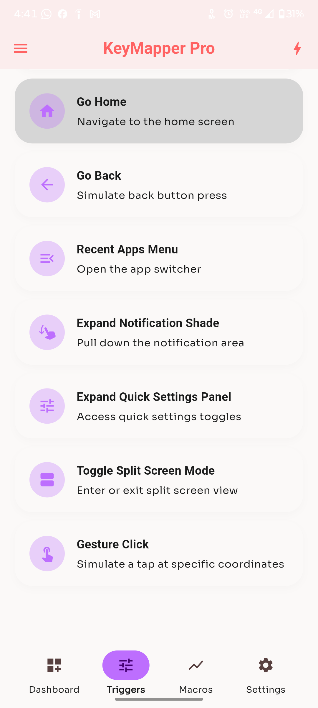</td>
    <td>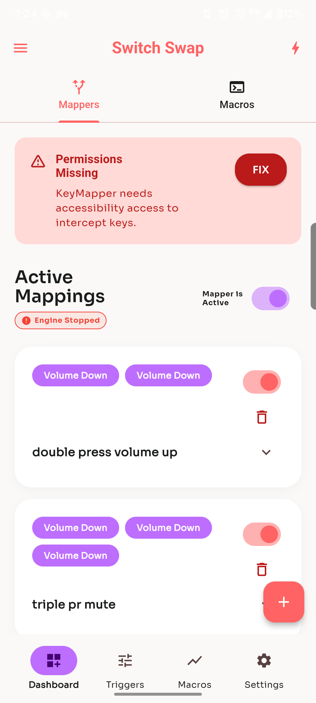</td>
    <td>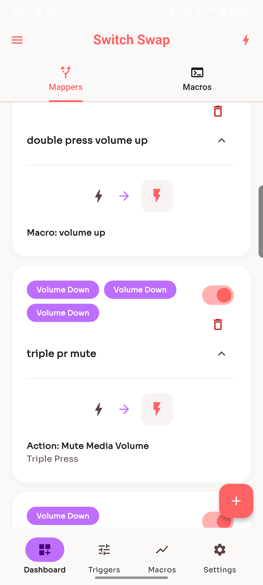</td>
  </tr>
</table>

---

### 🚦 Constraints & System Integration

<table>
  <tr>
    <td align="center"><b>Execution Constraints</b></td>
    <td align="center"><b>Core Functions Dashboard</b></td>
    <td align="center"><b>Android Accessibility Settings</b></td>
  </tr>
  <tr>
    <td>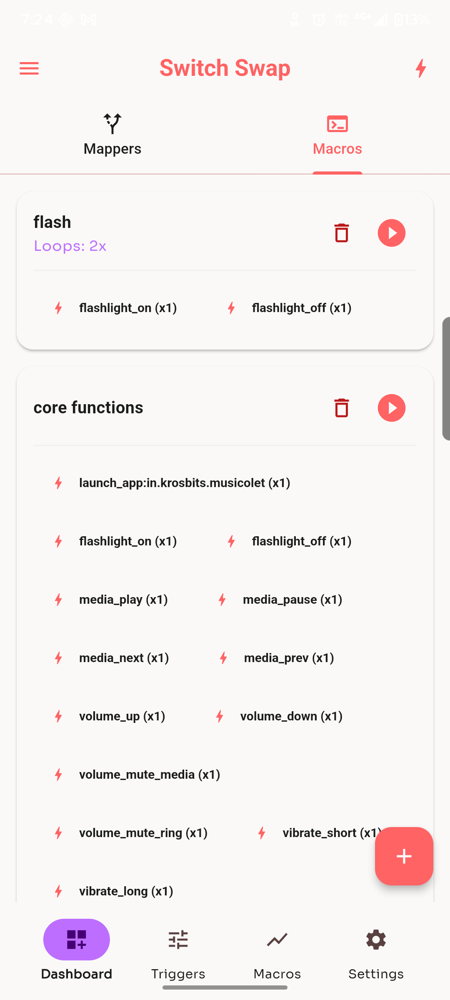</td>
    <td>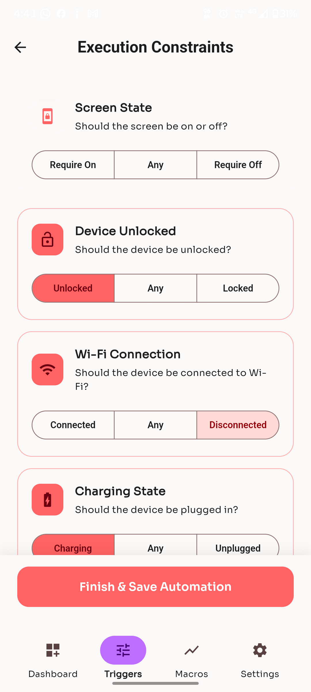</td>
    <td>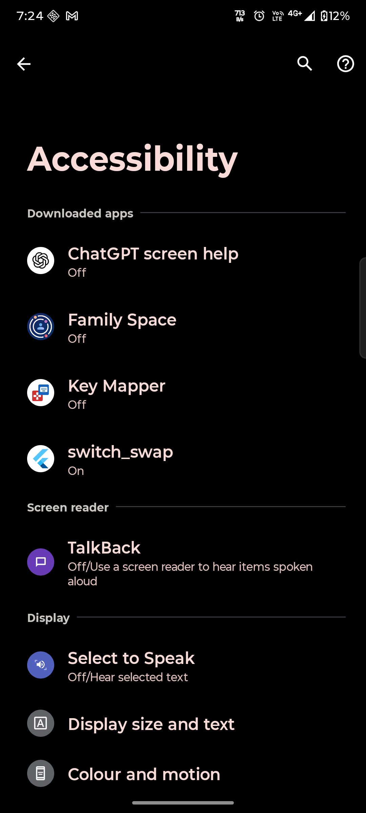</td>
  </tr>
</table>

</div>

---

## 🏗️ The Dual-Engine Architecture

```
┌──────────────────────────────────────────────────────────┐
│                    ENGINE 1 — FRONTEND                    │
│              Flutter UI (Dart, Riverpod)                  │
│                                                            │
│   Sequence Recorder UI  •  Profile Manager  •  Dashboard   │
│   ConsumerStatefulWidget  •  ref.watch / ref.read          │
└───────────────────────┬────────────────────────────────────┘
                        │  MethodChannel
                        │  (com.example.switch_swap/...)
┌───────────────────────▼────────────────────────────────────┐
│              NATIVE ANDROID LAYER (KOTLIN)                 │
│                                                            │
│  SwitchSwapAccessibilityService.kt                         │
│  └─ Globally intercepts onKeyEvent() before Android OS     │
│                                                            │
│  KeyRouterState.kt  (Traffic Cop)                           │
│  ├─ UI open?  → onUIHardwareEvent() → Frontend             │
│  └─ UI closed? → onHardwareEvent() → Background Isolate     │
│                                                            │
│  MasterActionRouter.kt  (Outbound Command Executor)         │
│  ├─ AudioManager      → Media / Volume controls             │
│  ├─ CameraManager     → Flashlight (setTorchMode)            │
│  └─ PackageManager    → App launching via Intents            │
│                                                            │
│  Passthrough Bridge → reinjects unmatched keys to OS         │
└───────────────────────┬────────────────────────────────────┘
                        │  Headless entry-point
┌───────────────────────▼────────────────────────────────────┐
│             ENGINE 2 — HEADLESS BACKEND                    │
│        @pragma('vm:entry-point') headlessTask               │
│             Runs INSIDE Kotlin AccessibilityService          │
│                                                            │
│  Trigger Matcher Service                                    │
│  ├─ 300ms rolling buffer of incoming keys                   │
│  └─ Matches buffered sequence against saved profiles         │
│                                                            │
│  Action Executor                                            │
│  └─ Fires matched payload via execute MethodChannel          │
│     back to MasterActionRouter.kt                            │
└───────────────────────┬────────────────────────────────────┘
                        │
┌───────────────────────▼────────────────────────────────────┐
│                  SHARED STATE LAYER                         │
│             Isar NoSQL (multi-isolate support)                │
│                                                            │
│  Isar.watchLazy() reactive stream                            │
│  └─ UI edits a macro → instant hot-reload of background       │
│     engine's in-memory List<AutomationProfile> cache          │
└──────────────────────────────────────────────────────────┘
```

---

## 🛠️ Tech Stack

```
├── Framework          →  Flutter (Dart) — 50.9%
├── Native Layer       →  Kotlin (Android AccessibilityService) — 7.7%
├── State Management   →  flutter_riverpod ^2.6.1 + riverpod_annotation ^2.1.1
├── Routing            →  go_router ^17.2.3
├── Database           →  isar ^3.1.0 + isar_flutter_libs ^3.1.0
├── Persistence        →  shared_preferences ^2.2.3
├── Hardware Control   →  volume_controller ^3.5.0, torch_light ^1.1.0
├── App Management     →  installed_apps ^2.1.1, device_apps ^2.2.0
├── Permissions        →  permission_handler ^12.0.3
├── Haptics            →  vibration ^3.1.8
├── External Links     →  url_launcher ^6.3.2
├── Typography         →  google_fonts ^8.1.0
├── Code Generation    →  build_runner, riverpod_generator, isar_generator
└── Platform Support   →  Android, iOS, Linux, macOS, Windows, Web
```

---

## 🔬 Engineering Deep Dive

### 1. The "Traffic Cop" Inbound Routing

A shared memory object (`KeyRouterState.kt`) determines, on every single keypress, whether the UI is currently visible:

- **UI open & in Sequence Recorder** → key routes to `onUIHardwareEvent()` for live recording
- **UI closed** → key is blindly thrown into the background Dart isolate via `onHardwareEvent()`

This means the *same* physical key can either build a macro or trigger one, depending purely on what screen is open — with zero ambiguity or double-handling.

### 2. Sub-300ms Sequence Matching

The Trigger Matcher Service maintains a live buffer of incoming keys on a strict **300ms timer**. Press a key → timer starts. Press another within 300ms → it's appended to the sequence array. When the timer expires, the buffered array (e.g. `[Volume Down, Volume Down]`) is compared against saved database profiles for an exact match — all without blocking the background thread.

### 3. Zero-Lag Database Sync Across Isolates

The UI and the headless engine live in **completely separate memory spaces**. Instead of querying Isar on every keypress (which would introduce lag), the background engine loads all active profiles into an in-memory `List<AutomationProfile>` cache at boot. Editing a macro in the UI triggers Isar's `watchLazy()` reactive stream, which **instantly hot-reloads** the background cache — sub-300ms matching, zero blocking, zero stale data.

### 4. Surviving Android's Doze Mode — The "Zombie Engine" Fix

Android aggressively kills background processes to save battery. When it later resurrects the Accessibility Service, it skips standard boot functions, leaving a **dead Dart isolate**. Switch Swap solves this with **Lazy Initialization directly inside `onKeyEvent()`**: if a physical button is pressed and Kotlin detects the Dart engine is dead, it triggers an **instant cold-boot sequence** to rebuild the isolate on the spot — ensuring macros never silently fail to trigger.

### 5. The Passthrough Safety Valve

If the background engine determines a keypress isn't part of any saved macro, it sends a `passthrough_keys` command back to Kotlin, which reinjects the raw key event back into the Android OS. This means your normal volume buttons, media controls, and system gestures **keep working exactly as expected** outside of your configured macros.

---

## 📁 Project Structure

```
Switch_Swap/
│
├── lib/
│   ├── main.dart                    # Entry point + @pragma('vm:entry-point') headlessTask
│   ├── ui/
│   │   ├── recorder/                # Sequence Recorder screen
│   │   ├── dashboard/                # Mappers & Macros dashboard
│   │   ├── macro_builder/            # Action chaining + Execution Loop
│   │   ├── triggers/                 # Configure Trigger + Constraints
│   │   └── settings/                  # App settings
│   ├── providers/                    # Riverpod providers (ConsumerStatefulWidget)
│   ├── models/                       # AutomationProfile, TriggerSequence (Isar collections)
│   ├── services/
│   │   ├── isar_service.dart          # Isar DB init + watchLazy() listeners
│   │   └── trigger_matcher.dart       # 300ms buffer matching logic (mirrors native isolate)
│   └── headless/
│       └── headless_task.dart          # Background isolate entry point
│
├── android/
│   └── app/src/main/kotlin/.../
│       ├── SwitchSwapAccessibilityService.kt   # Global onKeyEvent() interceptor
│       ├── KeyRouterState.kt                    # Traffic Cop — UI vs background routing
│       └── MasterActionRouter.kt                # AudioManager / CameraManager / PackageManager executor
│
├── ios/ linux/ macos/ windows/ web/   # Platform support
├── pubspec.yaml
└── wipe_db.dart                        # Isar database reset utility
```

---

## 🚀 Getting Started

### Prerequisites

- ✅ Flutter SDK `>=3.10.0 <4.0.0`
- ✅ Android Studio (for Kotlin native layer)
- ✅ Android device — **physical device strongly recommended** (Accessibility Service + hardware key interception don't behave reliably on emulators)
- ✅ Android 8.0+ (Accessibility Service requirement)

### Installation

**1. Clone the repository**
```bash
git clone https://github.com/Hemanshu4949/Switch_Swap.git
cd Switch_Swap
```

**2. Install dependencies**
```bash
flutter pub get
```

**3. Generate Isar & Riverpod code**
```bash
dart run build_runner build --delete-conflicting-outputs
```

**4. Run on a physical device**
```bash
flutter run
```

**5. Grant required permissions**

On first launch, Switch Swap will show a **"Permissions Missing"** banner. Tap **FIX** to be taken directly to:
```
Settings → Accessibility → Downloaded apps → switch_swap → Enable
```

This is required for the Accessibility Service to globally intercept hardware key events.

### Required Android Manifest Permissions

```xml
<uses-permission android:name="android.permission.MODIFY_AUDIO_SETTINGS"/>
<uses-permission android:name="android.permission.CAMERA"/>
<uses-permission android:name="android.permission.QUERY_ALL_PACKAGES"/>
<uses-permission android:name="android.permission.VIBRATE"/>
<service
    android:name=".SwitchSwapAccessibilityService"
    android:permission="android.permission.BIND_ACCESSIBILITY_SERVICE">
    <intent-filter>
        <action android:name="android.accessibilityservice.AccessibilityService"/>
    </intent-filter>
</service>
```

---

## 🎯 How To Build Your First Macro

```
1️⃣  Open Triggers tab → tap the mic to start "Listening"
         ↓
2️⃣  Press your physical key combo (e.g. Volume Down ×2)
         ↓
3️⃣  Tap "Confirm Sequence" → name your profile
         ↓
4️⃣  Go to Macros tab → tap "Add Action"
         ↓
5️⃣  Search 100+ commands → pick (e.g. "Turn Flashlight On")
         ↓
6️⃣  Set delay (ms) → add next action (e.g. "Short Vibration")
         ↓
7️⃣  Toggle "Execution Loop" → set Repeat Count if desired
         ↓
8️⃣  Tap "Save Macro" → done!
         ↓
🎉  Press your key combo anywhere — even with the app closed
```

---

## ⚙️ Action Categories

`🚀 Launch Application` &nbsp; `🔗 Open URL/Website` &nbsp; `🔦 Flashlight On/Off` &nbsp; `▶️ Media Play/Pause/Next/Prev` &nbsp; `🔊 Volume Up/Down/Mute` &nbsp; `📳 Vibrate (Short/Long)` &nbsp; `🏠 Go Home` &nbsp; `↩️ Go Back` &nbsp; `📱 Recent Apps Menu` &nbsp; `🔽 Expand Notification Shade` &nbsp; `⚙️ Expand Quick Settings` &nbsp; `🪟 Toggle Split Screen` &nbsp; `👆 Gesture Click (coordinate tap)`

---

## 🧪 Tested Real-World Scenarios

| Scenario | Result |
|---|---|
| Double press Volume Up → Trigger custom macro | ✅ Fires correctly, even with app swiped from recents |
| Triple press Volume Down → Mute media volume | ✅ Recognized via 300ms sequence buffer |
| App killed by Android Doze Mode → button pressed again | ✅ Cold-boot recovery rebuilds isolate instantly |
| Single Volume Down press (no macro match) | ✅ Passthrough — normal volume behavior preserved |
| Macro with Execution Loop ×4 | ✅ Repeats flashlight blink exactly 4 times |
| Execution Constraint: "Require Screen Off" | ✅ Macro correctly skipped when screen is on |

---

## 🔮 Future Scope

- 🎮 Full Gamepad & Headset trigger support (UI scaffolding already present)
- ☁️ Cloud backup/sync of macro profiles
- 🤝 Macro sharing/export between devices
- 📊 Usage analytics dashboard (most-triggered macros)
- 🧠 AI-suggested macros based on usage patterns

---

## 🤝 Contributing

```bash
git checkout -b feature/your-feature-name
git commit -m "Add: your feature description"
git push origin feature/your-feature-name
# Open a Pull Request 🎉
```

---

## 👨‍💻 Author

**Hemanshu Sojitra** — [@Hemanshu4949](https://github.com/Hemanshu4949)

---

<div align="center">

⭐ If Switch Swap impressed you, give it a star!

*Built with ❤️ — Flutter on top, Kotlin underneath, and a headless Dart isolate doing the real work.*

`Flutter` · `Kotlin` · `Riverpod` · `Isar NoSQL` · `Android AccessibilityService`

</div>
